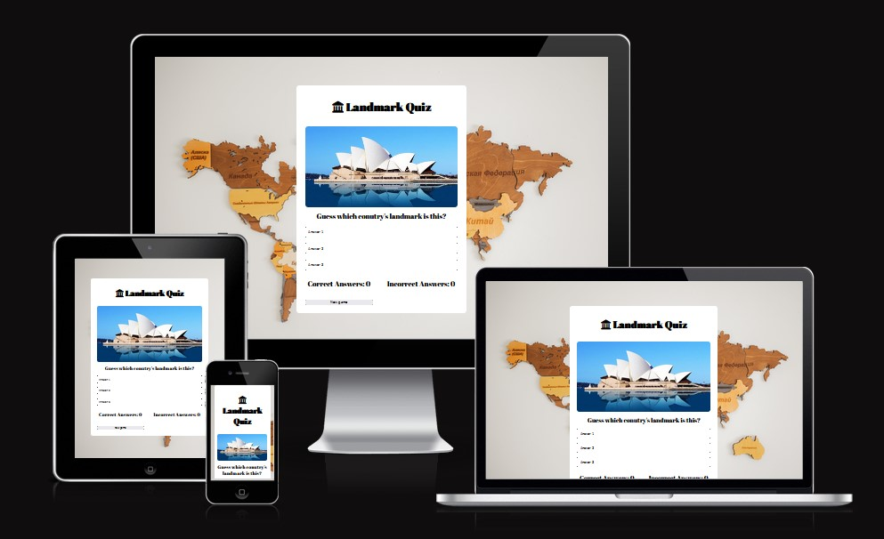
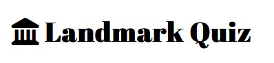
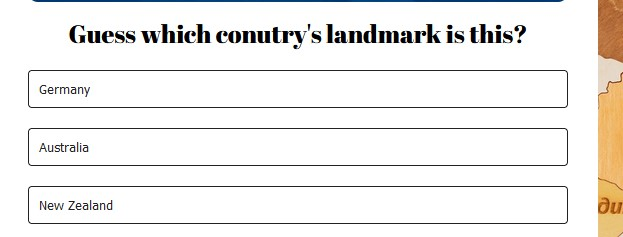
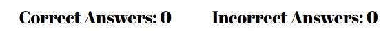
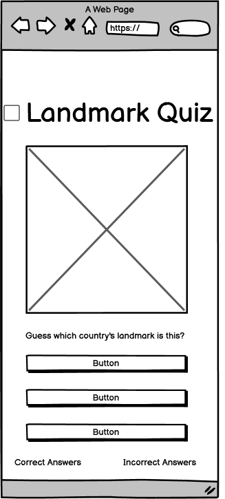
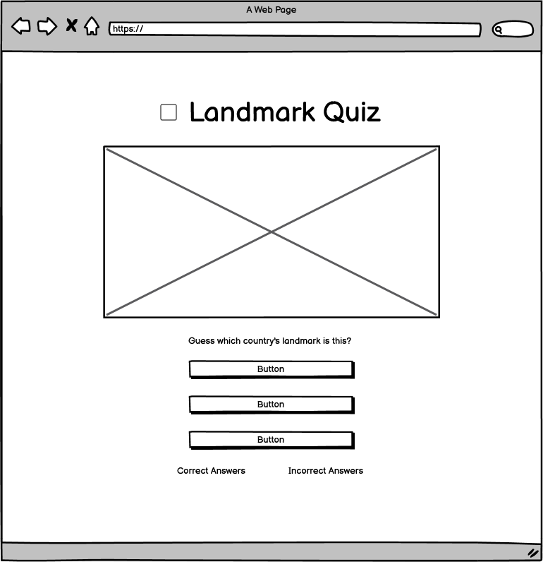
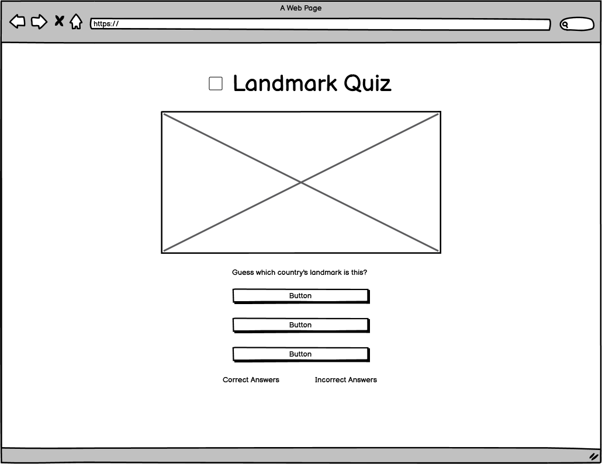

# Lnadmark Quiz

## Overview

[Link to my Landmark Quiz.](https://hsiaohan-89.github.io/landmark-quiz/)

## Landmark Quiz

Landmark Quiz is a website that features landmark pictures from different countries for users to guess which country they belong to. The game includes 10 landmarks from all over the world, spanning across Asia, Europe, and the US. By playing this game, users can expand their knowledge about the world and test their familiarity with different countries' landmarks. With each correct or incorrect answer, users can earn points and measure their progress.

[Back to top ⇧](#landmark-quiz)

## Features

### Existing Features

- **Header**

  - Featured at the top of the page, the header shows the game name. Landmark Quiz in a font xxxx
  - This header clearly tell the user what game they are playing.

- **The Game Option**

  - The game option is a multiple-choice quiz where users choose the correct country for each landmark.
  - you could start by displaying a landmark image and offering three possible country options.
  - This section provides interactive buttons that users can click to select the country that they think it is.

- **The Game Results**

  - When the user clicks an option, the information such as the number of landmarks correctly identified, the number of attempts made, will shown in the below of the option.
  - The results and the socre are clear to user, making the game easy to play. understand how many quiz has been answered.

### Features to Implement in the future

- xxxxxxx

## Design

#### Skeleton

Wireframes were made to showcase the appearance of the site pages while keeping a positive user experience in mind. The wireframes were created using a desktop version of [Balsamiq](https://balsamiq.com/).

Balsamiq Wireframes

#### Typography

The typography pairing used on the site are [Abril Fatface](https://fonts.google.com/specimen/Abril+Fatface?preview.text=hello&preview.text_type=custom&query=Abril+Fatface). imported from [Google Fonts](https://fonts.google.com/).A backup of Sans-Serif had been applied in case of import failure.
Abril Fatface was chosen for the title on the header, and using for the heading.

#### Imagery

The pictures were found from the [Travel news website](https://kknews.cc/travel/xmplpaq.html#google_vignette).

#### Icons

The icons resources is from [Font Awesome](https://fontawesome.com/).

[Back to top ⇧](#landmark-quiz)

## Issues and Bugs

The developer ran into a lot of the issues during the developemnnt of the game.

**Landmark Image** - A bug was deteced in the early stage, the image was not able to load when the game started. Only has the fram showed when user clicked the button.

Landmark Image

**Score** - A bug was deteced when click the correct and the incorrect answer the score number are not changed it. becasue was only use the function when the game finished and the result will calculated. After amend the code in checkAnswer ++ with the correctAnswer ++, and it worked fine.

**Landmark Image** - A bug was deteced in the early stage, the image was not able to load when the game started. Only has the fram showed when user clicked the button.

Landmark Image

## Technologies Used

### Main Languages Used

- [HTML](https://validator.w3.org/#validate_by_upload "Link to HTML markup validation service")
- [CSS](https://validator.w3.org/#validate_by_upload "Link to CSS validation service")
- [JAVASCRIPT](https://jshint.com/ "Link to JS Hint validator")

### Frameworks, Libraries & Programs Used

- [Google Fonts](https://fonts.google.com/ "Link to Google Fonts")
  - Google fonts was used to import the fonts "Abril Fatface", "Serif" into the HTML file. These fonts were used throughout the project.
- [Font Awesome](https://fontawesome.com/ "Link to FontAwesome")
  - Font Awesome was used on icon in font of the Header.
- [Codeanywhere](https://codeanywhere.com/ "Link to codeanywhere homepage")
  - Codeanywhere was used for writing code, commiting, and then pushing to GitHub.
- [GitHub](https://github.com/ "Link to GitHub")
  - GitHub was used to store the project after pushing
- [Balsamiq](https://balsamiq.com/ "Link to Balsamiq homepage")
  - Balsamiq was used to create the wireframes during the design phase of the project.
- [Am I Responsive?](http://ami.responsivedesign.is/# "Link to Am I Responsive Homepage")
  - Am I Responsive was used in order to see responsive design throughout the process and to generate mockup imagery to be used.

[Back to top ⇧](#landmark-quiz)

## Testing

### Manual Testing

**Wellcome alert**

### Lighthouse Testing

## Deployment

This project was developed using [codeanywhere](https://codeanywhere.com/ "Link to codeanywhere site"), which was then committed and pushed o GitHub using the GitPhub terminal.

### Deploying on GitHub Pages

To deploy this page to GitHub Pages from its GitHub repository, the following steps were taken:

1. Log into [GitHub](https://github.com/login "Link to GitHub login page") or [create an account](https://github.com/join "Link to GitHub create account page").
2. Locate the [GitHub Repository](https://github.com/Hsiaohan-89/Iris-Chen-portfolio "Link to GitHub Repo").
3. At the top of the repository, select Settings from the menu items.
4. Scroll down the Settings page to the "Pages" section.
5. Under "Source" click the drop-down menu labelled "None" and select "Main".
6. Upon selection, the page will automatically refresh meaning that the website is now deployed.
7. Scroll back down to the "Pages" section to retrieve the deployed link.

## Credits

### Content

- Some of the frame design ideas were borrowed and adapted from various sites below:
  - [Love maths website](https://github.com/Code-Institute-Solutions/love-maths-2.0-sourcecode)
  - [GreatStack](https://www.youtube.com/@GreatStackDev)
  - [Mikke Gose Coding](https://mikkegoes.com/javascript-projects-for-beginners/)

### Media

- The backgronnd is sourced from [Pexels](https://www.pexels.com/search/map/).

[Back to top ⇧](#landmark-quiz)

## Acknowledgements

[Back to top ⇧](#landmark-quiz)
