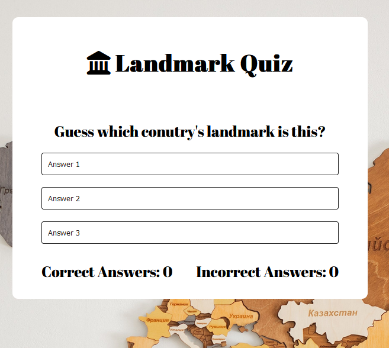
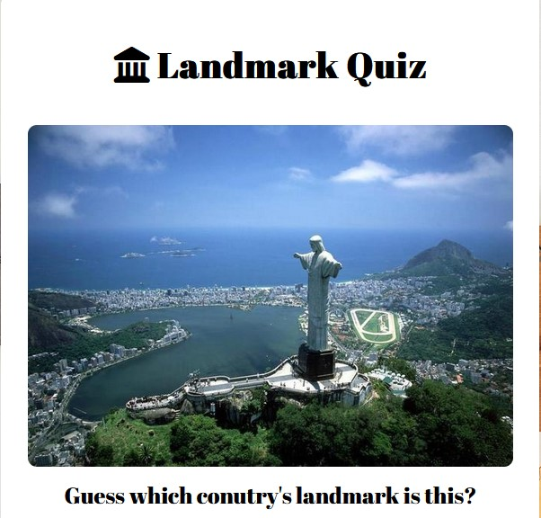

# Lnadmark Quiz

## Overview

[Link to my Landmark Quiz.](https://hsiaohan-89.github.io/landmark-quiz/)

## Landmark Quiz

Landmark Quiz is a website that features landmark pictures from different countries for users to guess which country they belong to. The game includes 10 landmarks from all over the world, spanning across Asia, Europe, and the US. By playing this game, users can expand their knowledge about the world and test their familiarity with different countries' landmarks. With each correct or incorrect answer, users can earn points and measure their progress.

[Back to top ⇧](#landmark-quiz)

## UX

### Ideal User Demographic

The ideal user for this website is :

- Everyone who travel a lot and like games.
- People who like to learn about the other country landmark.

### User-Stories

### Goals

- Play games meanwhile also learning about the country's landmarks and culture.
- Why Landmark Quiz is the perfect game to play with friends and family.
- How Landmark Quiz can help you plan your next travel adventure.

### Development-Planes

Unlock your inner explorer with Landmark Quiz! Test your knowledge of the world's most famous landmarks while expanding your cultural horizons.

#### Strategy

With each correct answer, you'll feel a sense of accomplishment and a desire to keep going. The world is full of wonders waiting to be discovered, so why not start your journey today with Landmark Quiz?

#### Scope

The scope of this game is to explore the benefits of using Landmark Quiz as a tool for expanding one's cultural knowledge. Additionally, the game will explore how Landmark Quiz can be used as a fun and interactive way to teach children about different cultures and landmarks around the world.

## Features

### Existing Features

- **Welcome Alert**

  - Welcome Alert will prompt when the user is enter the website.

- **Header**

  - Featured at the top of the page, the header shows the game name. Landmark Quiz.
  - This header clearly tell the user what game they are playing.

- **The Game Option**

  - The game option is a multiple-choice quiz where users choose the correct country for each landmark.
  - you could start by displaying a landmark image and offering three possible country options.
  - This section provides interactive buttons that users can click to select the country that they think it is.

- **The Game Results**

  - When the user clicks an option, the information such as the number of landmarks correctly identified, and the number of attempts made, will shown below the option.
  - The results and the score are clear to the user, making the game easy to play. understand how many quiz has been answered.

- **Correct Alert**

  - When the user select the corrtct answer. The alert prompt will showed Correct! Great job!

- **Incorrect Alert**

  - When the user select the incorrtct answer. The alert prompt will showed sorry, that's the incorrect. The correct answer is: XXXX.

- **Social Media Account**

  - The icons are appropriate representations of the Social Media platforms, GitHub account. The icons appear in the centre of the footer.

### Features to Implement in the future

- **More Quiz**
  - **Feature** - Have more quizzes and interactive functions wish to give more information when the incorrect answered.

## Design

#### Skeleton

Wireframes were made to showcase the appearance of the site pages while keeping a positive user experience in mind. The wireframes were created using a desktop version of [Balsamiq](https://balsamiq.com/).

Balsamiq Wireframes

#### Typography

The typography pairing used on the site are [Abril Fatface](https://fonts.google.com/specimen/Abril+Fatface?preview.text=hello&preview.text_type=custom&query=Abril+Fatface). imported from [Google Fonts](https://fonts.google.com/).A backup of Sans-Serif had been applied in case of import failure.
Abril Fatface was chosen for the title on the header, and using for the heading.

#### Imagery

The pictures were found from the [Travel news website](https://kknews.cc/travel/xmplpaq.html#google_vignette).

#### Icons

The icons resources is from [Font Awesome](https://fontawesome.com/).

[Back to top ⇧](#landmark-quiz)

## Issues and Bugs

The developer ran into a lot of the issues during the developemnnt of the game.

**Landmark Image** - A bug was deteced in the early stage, the image was not able to load when the game started. Only has the fram showed when user clicked the button.

Landmark Image

**Score** - A bug was detected when clicking the correct and incorrect answer the score number is not changed. because was only use the function when the game finishes and the result will be calculated. After amended the code in checkAnswer ++ with the correctAnswer ++, and it worked fine.

**Landmark Image** - A bug was detected in the early stage, the image was not able to load when the game started. Only the frame showed when the user clicked the button.

Landmark Image

## Technologies Used

### Main Languages Used

- [HTML](https://validator.w3.org/#validate_by_upload "Link to HTML markup validation service")
- [CSS](https://validator.w3.org/#validate_by_upload "Link to CSS validation service")
- [JAVASCRIPT](https://jshint.com/ "Link to JS Hint validator")

### Frameworks, Libraries & Programs Used

- [Google Fonts](https://fonts.google.com/ "Link to Google Fonts")
  - Google fonts was used to import the fonts "Abril Fatface", "Serif" into the HTML file. These fonts were used throughout the project.
- [Font Awesome](https://fontawesome.com/ "Link to FontAwesome")
  - Font Awesome was used on icon in font of the Header.
- [Codeanywhere](https://codeanywhere.com/ "Link to codeanywhere homepage")
  - Codeanywhere was used for writing code, commiting, and then pushing to GitHub.
- [GitHub](https://github.com/ "Link to GitHub")
  - GitHub was used to store the project after pushing
- [Balsamiq](https://balsamiq.com/ "Link to Balsamiq homepage")
  - Balsamiq was used to create the wireframes during the design phase of the project.
- [Am I Responsive?](http://ami.responsivedesign.is/# "Link to Am I Responsive Homepage")
  - Am I Responsive was used in order to see responsive design throughout the process and to generate mockup imagery to be used.

[Back to top ⇧](#landmark-quiz)

## Testing

### Manual Testing

**Wellcome alert**

- **_Expect_** - When the uset enter the webpage first will have a prompt showed to welcome user.
- **_Action_** - Cliek the landmard quiz link.
- **_Reault_** - The prompt is successfully prompt welcome user.

  <deaails>

  

**Result section**

- **_Expect_** - When the user select the correct answer or the wrong answer the result section will show how many were answered correct and how many were incorrect.
- **_Action_** - Select the correct correct answer and the result will add 1 number, otherwise will add 1 incorrect.
- **_Reault_** - The result react correctly when the user select the right answer and the wrong answer.
 <deaails>

**Landmark Image**

- **_Expect_** - Wehn the user finish one question, the next image will appear immidiately.
- **_Action_** - Choose any of the answer.
- **_Reault_** - The image appear when the user select one of the answer.
   <deaails>

**_Correct Alert_**

- **_Expect_** - When user select right answer, the alert will show to let user know that's the right answer.
- **_Action_** - Select the right answer from the button.
- **_Result_** - The alert show Correct, Great job!.
  <deaails>

**_Incorrect Alert_**

- **_Expect_** - When user select wrong answer, the alert will show to let user know that's the wrong answer, and which one is the right answer.
- **_Action_** - Select the wrong answer from the button.
- **_Result_** - The alert show Sorry, that's the incorrect. The correct answer is: XXXX.
  <deaails>

**_Social icon link_**

- **_Expect_** - Social icon when clicked will open another page and to the sign in page.
- **_Action_** - Clicked on the social icon
- **_Result_** - open a new page with sign in to your social account.
  <deaails>

### Validator Testing

**HTML**

[The W3C Markup](https://validator.w3.org/#validate_by_input)

There is an error that haven't been fix.

**CSS Style**

[The W3C CSS Validator](https://jigsaw.w3.org/css-validator/)

**JavaScript**

[JS Hint](https://jshint.com/)

### Lighthouse Testing

**_Landmark Quiz_**

Landmark Quiz

## Deployment

This project was developed using [codeanywhere](https://codeanywhere.com/ "Link to codeanywhere site"), which was then committed and pushed o GitHub using the GitPhub terminal.

### Deploying on GitHub Pages

To deploy this page to GitHub Pages from its GitHub repository, the following steps were taken:

1. Log into [GitHub](https://github.com/login "Link to GitHub login page") or [create an account](https://github.com/join "Link to GitHub create account page").
2. Locate the [GitHub Repository](https://github.com/Hsiaohan-89/Iris-Chen-portfolio "Link to GitHub Repo").
3. At the top of the repository, select Settings from the menu items.
4. Scroll down the Settings page to the "Pages" section.
5. Under "Source" click the drop-down menu labelled "None" and select "Main".
6. Upon selection, the page will automatically refresh meaning that the website is now deployed.
7. Scroll back down to the "Pages" section to retrieve the deployed link.

## Credits

### Content

- Some of the frame design ideas were borrowed and adapted from various sites below:
  - [Love maths website](https://github.com/Code-Institute-Solutions/love-maths-2.0-sourcecode)
  - [GreatStack](https://www.youtube.com/@GreatStackDev)
  - [Mikke Gose Coding](https://mikkegoes.com/javascript-projects-for-beginners/)
  - [Chat GPT](https://chat.openai.com/)
  - [MDN Web Developer](https://developer.mozilla.org/en-US/)
  - [W3School](https://www.w3schools.com/)
  - [Guess The Flag](https://devpost.com/software/guess-the-flag)

### Media

- The backgronnd is sourced from [Pexels](https://www.pexels.com/search/map/).
- The pictures were found from the [Travel news website](https://kknews.cc/travel/xmplpaq.html#google_vignette).

[Back to top ⇧](#landmark-quiz)

### Code

The developer consulted multiple sites in order to better understand the code they were trying to implement. For code that was copied and edited, the developer made sure to reference this with the code. The following sites were used on a more regular basis:

- [Stack Overflow](https://stackoverflow.com/ "Link to Stack Overflow page")
- [W3Schools](https://www.w3schools.com/ "Link to W3Schools page")
- [JSHint](https://jshint.com/ "Link to JS Hint page")

## Acknowledgements

- I would like to tank my friend who fave me some of the advice for my Landmrrk quiz idea.
- I would like to thank code insitute tutor John who help me with lot of isseus that I met during the coding.

[Back to top ⇧](#landmark-quiz)
